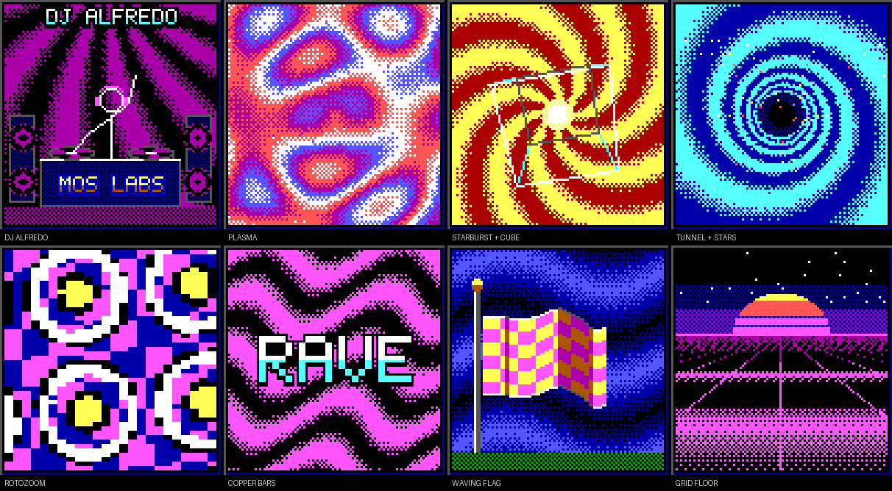
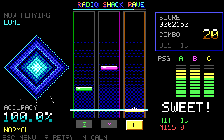
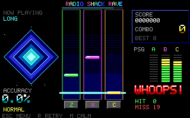

# Radio Shack Rave

You've got questions. We've got bangers.

A three-key rhythm game for the Tandy 1000 EX class: 320x200, 16 colors and the
three-voice PSG. Notes fall down three lanes; tap **Z / X / C** as they cross the
hit line. Required notes only sound when you hit them; the rest of the melody and
the backing keep playing either way.

The **v6 showcase engine**: an attract-mode splash, a title screen, a kiosk demo
loop, a bounded shuffled song catalog, smooth-scrolling playfield, hit bursts,
live PSG meters, varied judgment words, a graded results card, and a left-panel
effects window starring DJ Alfredo. There is no official Radio Shack sponsorship
or affiliation.

| | |
| --- | --- |
|  |  |
|  |  |

Screens are DOSBox-X Tandy captures of the bundled build (`RSRAVE /TOUR`).

## Play

Extract the DOS package into a folder such as `C:\RAVE` and run `PLAY`. No
Python is needed on the DOS machine.

| Key | Splash / title | In a song | Results |
| --- | --- | --- | --- |
| Space | play | | back to title |
| Z X C | | tap lanes | |
| R | | restart | play again |
| M | calm on/off | calm on/off | |
| Esc | exit to DOS | back to title | back to title |

Leave the title alone for 20 seconds and the store demo starts: the game plays
itself with a "DEMO" banner, shows its results and returns to the splash, so the
full attract loop repeats like a store kiosk. With a `SONGS` folder each loop
plays the next shuffled song, and the title always names the song that Space
(or the next demo) will play. Space jumps from the demo straight into a real
game; Escape in the demo goes back to the title.

**Calm mode** stops all background motion (left-panel effects and palette
cycling, title floor, marquee, twinkle, burst particles). Notes, judgments and
text still appear. There is no strobe in either mode.

### The left panel

A framed window beside the lanes changes scene every two bars and keeps
rotating across songs: **DJ Alfredo** on the decks, plasma, a spiral starburst
with a rotating wireframe cube, a starfield tunnel, a rotozoomer, copper bars,
a waving checkered flag and a synthwave grid floor.



### High scores

Each song keeps its top five in `RAVE.HI` beside the game. When a real game
earns a place, the results card asks for initials: type up to three letters,
Enter saves, Backspace corrects, Escape skips. The title marquee names the
song's top raver, and the store demo shows a **TOP RAVERS** page for a song
that has scores before returning to the splash. Demos and scripted runs never
record. Nothing is written unless you press Enter on your initials; a save to a
write-protected floppy reports "not saved" and the game carries on.

Timing allows three BIOS ticks either side (about 165 ms). Within one tick is
AWESOME (100 points), two or three ticks is NICE (60), plus a combo bonus up to
50. The grade is S (98%+, no misses), A (93%), B (85%), C (70%) or D.

### Your own logo splash

The game shows `LOGO.BIN` from its folder, if present, before the splash.
Nothing is bundled. Convert artwork you have the rights to use:

```
python tools/make_splash.py yourlogo.png LOGO.BIN --key-white --preview preview.png
```

`--key-white` lifts ink-on-white artwork onto the black screen; `--dither` helps
photographs. `/NOLOGO` skips it.

## Your own songs

Use Python 3 (standard library only) on a modern computer:

```
python tools/import_score.py your-song.mml MYSONG.RBG --lead 1 --difficulty easy --title "My Song"
python tools/import_score.py your-song.mml MYSONG.RBG --lead 1 --parts 1,2,3 --drums 4 --title "My Song"
```

**Drums.** `--drums VOICE` takes an MML voice written as General MIDI
percussion (the note number picks the drum, as on MIDI channel 10) and plays it
on the PSG's fourth voice, the noise channel: kick 35-36, snare 37-40, closed
hat 42/44 and small percussion, open hat 46, crash/ride 49-59, low and high
toms. Volume sets each hit's level. Hits keep their BIOS tick; two on one tick
keep the stronger (crash, snare, kick, toms, hats). Unmapped keys are rejected
with their time. The drum voice is never used as a tone part and the fourth
PSG meter (N) shows it. A file with drums is **RBG5**: RBG4 plus a drum table.

Copy your own or licensed RBG files into `SONGS` beside the executable. `PLAY`
uses a shuffled bag; two or more usable tracks do not immediately repeat across
cycles. `RSRAVE /DEMO` starts automatic shuffled demos. `PLAY MYSONG.RBG` or
`RSRAVE MYSONG.RBG` keeps a fixed file. The
converter writes a deterministic report JSON and normalized event JSON too.

The v6 format is **RBG4**: RBG3 plus a 24-character title, the difficulty and
a beat grid (runs of equally spaced quarter-note beats in 16.16 BIOS ticks,
taken from the MML tempo map). The grid drives the scrolling beat and bar lines
and keeps the left-panel effects on the beat. RBG2 and RBG3 files still load; they get no beat grid
and use the file name as their title.

Existing RBG2/RBG3 song files can be used directly with this branch: copy them
beside the new executable in a separate folder. Do not overwrite an existing
song kit. No per-song migration or chart edits are required. Legacy files keep
their authored pitch/onset/release and required/automatic flags; RBG4 adds only
the title/difficulty/beat metadata. Synthetic CI checks cover all three formats.
Local-only compatibility checks cover the preserved library; those song files
and their audio/notation are not included in public artifacts.

The Watcom cross-build now applies a checked 4096-paragraph extra DOS allocation
cap, matching the intent of the MSC6 linker cap. The 9 KB far cache and 4.8 KB
scene buffer fit within that budget. This is an allocation bound, not a physical CPU performance claim.

Bounded ArcheAge-style MML profile: optional `MML@...;`, case-insensitive notes,
rests, sharps/flats, octaves, lengths, dots, tempo, volume, same-pitch ties and
up to eight comma voices. Defaults O4/L4/T120/V100 are reported. Tempo conflicts,
unknown syntax, overflow and unsupported effects fail with explanatory errors.
Selected PSG voices must fit MIDI 45..96; use explicit transposition, never
clamping. Up to three tones are selected; percussion only from an explicit
`--drums` voice, never invented.
Runtime bounds are 2048 lead events, 4096 backing states, 4096 drum hits,
64 tempo runs and 600 seconds; MML sources up to 128 KB. These were 512 lead
events and 1024 backing states, which is why a five-minute song such as a full
arrangement had to be split. The song tables now live in far memory, sized to
each song as it loads, so short songs cost no more than before and a long one
loads whole. On a machine without enough free memory for a given song, the
game says so instead of loading it.

The original 32-second composition **Circuit After Hours** has 128 lead onsets:
64 required taps and 64 automatic notes. Its source MML and permissive grant are
in `music`.

## How it works

* **Fine clock without touching the timer.** PIT0 is never reprogrammed. The
  game latches counter 0 and combines it with the BIOS tick count. The BIOS runs
  PIT0 in mode 3, where one latch is ambiguous by half a tick; readings are kept
  monotonic to resolve it (mode 2 is detected and handled too). Notes move with
  sub-tick precision instead of jumping 3 pixels 18 times a second.
* **Judgment is still tick-deterministic.** The same core (`src/CORE.H`) runs
  in the DOS game and in the host tests. Key presses are judged at the tick
  they were pressed (stamped in the keyboard interrupt), not when the frame
  loop reaches them, and before misses expire.
* **Full late window.** A late press inside the +/-3 tick window always scores,
  even when the note's tone has ended or a newer automatic note already owns
  the lead channel; it just does not replay the tone.
* **Row compositor.** Each lane row is a one-byte code (background, beat line,
  gem row, burst row). A frame builds wanted codes, then rewrites only rows that
  differ, as whole bytes. Text, panels and spans use `REP STOSB/MOVSB` through
  the far string routines; row addresses come from a table, not an 8088 `MUL`.
* **Palette cycling.** Logical colors 3, 4, 7 and 9 appear only inside the
  left-panel window; nothing else on the playfield or results card uses them
  (CI checks this on a captured frame). Each scene is a precomputed map of
  cycle phases, ordered-dithered between phases so motion looks continuous,
  generated offline by `tools/gen_fx.py` into `src/FXDATA.H`. Animating it is
  four Tandy palette register writes (index `10h+n` to `3DAh`, color to `3DEh`)
  in vertical blank, whatever the size of the effect. Plasma, starburst,
  tunnel, copper bars, sky, spotlights, speaker cones and spinning platters
  all move this way. Title and splash restore the default palette.
* **CPU effects on a budget.** The cube, starfield, rotozoomer (4x2-pixel
  cells drawn in bands), waving flag (two-pixel columns on a travelling sine,
  shaded by slope) and DJ Alfredo (redrawn only when his pose changes) run
  after the lanes and HUD, spending a per-frame time credit. A slow machine
  refreshes them less often, and if the playfield alone is running long the
  rotozoomer and flag are skipped. Judgment and audio never read anything in
  the window. Scene changes are a two-pass curtain: the old scene scans out
  to black, the new one scans in.
* **Songs in far memory.** Backing states, lead notes, judgments and drum
  hits are allocated in far memory when a song loads, grown only when a bigger
  song arrives. Small-model stdio reads near buffers, so the loader fills the
  far tables through a 512-byte bounce buffer. The 64 KB near segment no
  longer holds any song data.
* **Drum channel.** A drum hit writes the noise control (periodic or white,
  shift rate), which restarts the shift register for a clean attack, then
  decays linearly in fine time rather than in 55 ms ticks. Audio (lead,
  backing, drums) is also serviced between the playfield's drawing stages,
  so a slow frame no longer delays it by the whole frame; a hit noticed up to
  a tick late still plays in full.
* **Far cache.** Key caps and outlined judgment words are rendered once into a
  9 KB far block, and the current scene is decoded into a 4.8 KB far buffer
  used to restore pixels under moving figures (all within `LINK /CP:4096`).
* **Frame pacing.** Each frame starts at vertical retrace; a frame that ran
  longer than a quarter tick skips the wait instead of losing another.
* Exit restores video mode, IRQ1, sound ownership and the speaker; PIT0 is
  only read. Run in an exclusive plain-DOS foreground session.

## Build and checks

The game is one C89 translation unit (`src/BEAT.C` and its headers) plus the
unchanged cooperative sound adapter `src/DOSSND.C`.

* **Microsoft C 6** (reference): small model `/G0 /AS /O /W3`, then `BUILD.BAT`.
* **OpenWatcom 2** (cross-build from Linux, macOS or WSL):
  `WATCOM=/path/to/ow tools/build_ow.sh` writes `runtime/RSRAVE.EXE`.
  The bundled v6 preview executable was built this way.

`python -B tests/run_checks.py --cc gcc` runs the host checks: pinned files,
include closure, a strict C89 type-check of the whole DOS game through a small
`<dos.h>` shim, converter and retention tests, and the real judgment core on the
original song.

`WATCOM=... python tests/dos_smoke.py` builds with OpenWatcom and runs the
native diagnostic cases inside DOSBox-X (`machine=tandy`), headless. Every
audio trace (all-hit, all-miss, calm, retry, input spam, and the three
simulations) must be byte-identical to the recorded v5 native evidence, and
every exit path must restore video, keyboard, sound and speaker. It then runs
`tests/dos_songs.py` (a dense 70-second song past the old caps played to the
last note, and a drum song whose live and simulated hits must equal the
converter's table) and `tests/dos_hiscore.py` (ranks and ties, a full board,
a malformed and an unwritable `RAVE.HI`, and that scripted play never writes).

`tests\NATIVE.BAT` reproduces the same cases natively with your own MSC6
toolchain at C:, this package at D: and a scratch directory at E:.

### Captures and video

`RSRAVE /TOUR` runs splash, title, demo and results on a virtual clock, saving
every frame (`Fnnnnn.RAW`, half a tick apart), every PSG write (`PSG.LOG`) and
every palette change (`PAL.LOG`). `python tools/tour_video.py CAPTURE_DIR
rave.mp4` turns that into a frame-exact video with the palette applied and
re-synthesized PSG audio (needs numpy and ffmpeg).

`python tools/gen_fx.py` regenerates the left-panel data (`--preview DIR`
writes PNGs); the host checks fail if `src/FXDATA.H` is stale. `/RENDER` applies
the virtual clock to any mode.

### Diagnostic switches

`/AUTO /MISS /RETRY /ESC /SPAM /HESC /EARLY /REF` scripted games; `/TEST`
core self-test; `/SIMH /SIMM /SIMR` simulations; `/SPLASH /SSKIP /SESC /SCALM`
splash checks; `/SHOT` frame dump; `/DEMO` start in the attract demo;
`/HISCORE` autoplay that enters initials CLD; `/CALM`, `/FXOFF`, `/NOLOGO`,
`/NOVSYNC`. Only scripted runs write log files. An ordinary game writes only
`RAVE.HI`, and only after you enter initials, so it runs from a
write-protected floppy.

## Status

The tested local candidate passes host and original synthetic native fixture
checks, including catalog discovery, invalid/disappeared files, shuffle, fallback,
explicit launch, demo advance, word bounds and video/IRQ1/sound cleanup. It has **not**
been rebuilt with MSC6 or run on a physical Tandy yet; see `QUALIFICATION.json`.
DOSBox cycle settings are not calibrated hardware timing. The v5 native evidence
in `evidence/NATIVE` remains the reference for audio and judgment behavior.

Game/converter: GPL version 3, `LICENSE` and `NOTICE.TXT`. Original music has a
separate permissive grant in `music/LICENSE.TXT`. Keep source and notices with forks.

## Playlist and feedback update

Discovery reads only directory metadata: at most 64 candidate 8.3 filenames and
1024 directory matches. A selected file receives full RBG2/3/4 validation before
playback. Invalid or disappeared candidates are disabled; empty/all-invalid
catalogs fall back to `ORIGINAL.RBG`. If that also fails, hardware is untouched.
Files beyond the candidate limit require explicit selection or a smaller folder.
Space starts real play on the current demo song; R retries current real play.
Escape during the demo or real play returns to the title; Escape at the title
or splash exits to DOS.
Explicit filenames and scripted diagnostics bypass discovery. Normal play writes
no logs and performs no SHA checks.

Great judgments rotate RAD!, SWEET!, STELLAR!, NAILED!, LETS GO! and WICKED!;
misses rotate OOPS!, WHIFF!, WHOOPS! and AGAIN!. NICE! is unchanged. Timing,
scoring, original Claude font/color/shadow/pop placement and gameplay randomness
are unchanged. Precomputed sprite cache uses 8,658 of 9,216 bytes.




These are local native captures of original synthetic LONG charts, not imported
music. Local DOSBox-X 2025.12.01 raised a host shutdown exception after the guest
suite wrote its passing cleanup records; the cause remains unresolved. Host and
guest results are recorded separately. No physical Tandy timing/listening claim.

## Offline MIDI conversion

`python tools/midi_to_mml.py YOUR-ORIGINAL.mid --list`

Select up to three monophonic voices with `--voice TRACK.CHANNEL:top` or
`:bottom`, then use `-o YOUR-ORIGINAL.mml --check`. The first voice is the lead.
The tool reports quantizing, polyphony reduction, excerpt boundaries and any
whole-octave shift needed by `import_score.py`; `--fold` explicitly permits
individual octave folding. It uses the Python standard library, reads local
files, and contains no music. Use music you are entitled to convert and share.

MML is limited to 131,072 bytes; the runtime accepts at most 2,048 lead events,
4,096 backing states, 4,096 drum hits and 600 seconds. `--check` applies the
production converter before writing output. Invalid/truncated MIDI fails with
an error, and bounded input/grid/reduction limits prevent unbounded work.

The left panel uses host-packed images and holds each completed scene for at
least 16 beats and 146 BIOS ticks. This removes runtime phase/overlay decoding
and the duplicate scene heap image. Palette, lane, clock and input behavior are
preserved; emulator measurements are not physical Tandy speed claims.

## Optional metrical converter policy

`python tools/import_score.py your-original.mml MYSONG.RBG --chart-policy metrical --difficulty normal`

The optional offline policy prefers source quarter/eighth onsets within the
elapsed-time density limit. It never shifts an onset or deletes a sounding note;
thinned notes remain automatic. Easy/normal required tones must survive the
three-tick late window, and same-lane required windows are separated by seven
BIOS ticks so one delayed input cannot steal the next required note. Unknown or
unrepresentable syntax still fails explicitly. Existing RBG files are not rewritten.
The default `elapsed` policy remains available; `full` keeps its documented risk
for dense/short notes.

Backing untied-note articulation/envelopes, a song noise/drum format and RMS VU
are **not implemented**. Meters show programmed PSG levels. Four-quarter visual
accents do not encode every source meter. No private song PDF/MML/MIDI/audio or
chart catalog is published here; only original demo and synthetic fixtures.

## Reproducible CI toolchain

The workflow uses the official OpenWatcom release tag `2026-10-01-Build`, not the
rolling `Current-build` asset. The downloaded archive was independently verified:
SHA-256 `e6aa1b1e40ac8bbf97658d2c70fff8a4242d6ca4a1c60806f2baa5317083d4fe`.
CI still verifies that hash and requires its fresh DOS binary to match the pinned
runtime before diagnostics. Build/evidence artifacts identify the exact source
head and executable hash. Native playlist CI uses original short fixtures only.
