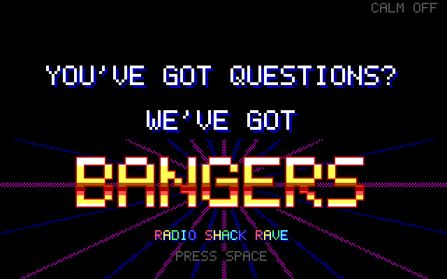
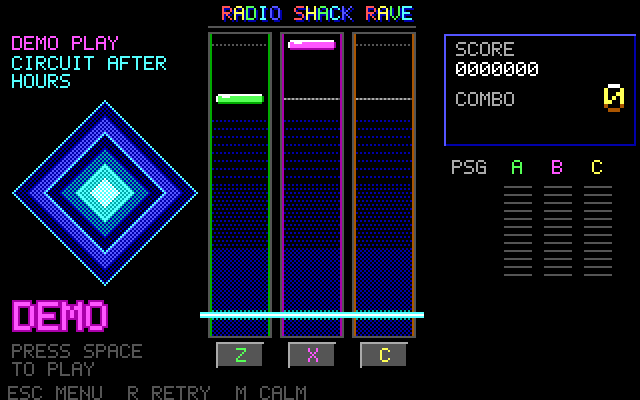
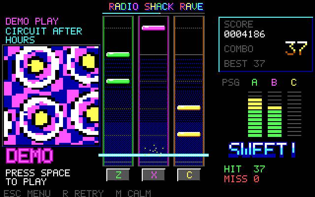
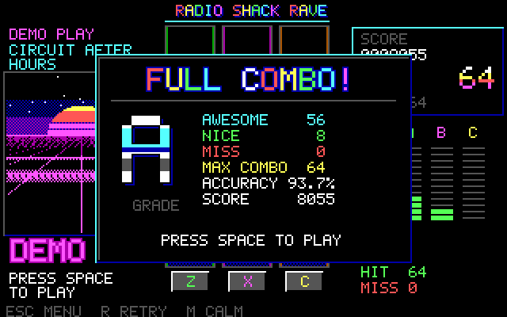

# Radio Shack Rave

You've got questions. We've got bangers.

A three-key rhythm game for the Tandy 1000 EX class: 320x200, 16 colors and the
three-voice PSG. Notes fall down three lanes; tap **Z / X / C** as they cross the
hit line. Required notes only sound when you hit them; the rest of the melody and
the backing keep playing either way.

This is the **v6 showcase engine**: an attract-mode splash, a title screen,
a kiosk demo loop, smooth-scrolling playfield, hit bursts, live PSG meters and a
graded results card. There is no official Radio Shack sponsorship or affiliation.

| | |
| --- | --- |
|  |  |
|  |  |

Screens are DOSBox-X Tandy captures of the bundled build (`RSRAVE /TOUR`).

## Play

Extract the DOS package into a folder such as `C:\RAVE` and run `PLAY`. No
Python is needed on the DOS machine.

| Key | Splash / title | In a song | Results |
| --- | --- | --- | --- |
| Space | play | | back to title |
| Z X C | | tap lanes | |
| R | | restart | play again |
| M | calm on/off | calm on/off | |
| Esc | exit to DOS | back to title | back to title |

Leave the title alone for 20 seconds and the store demo starts: the game plays
itself with a "DEMO" banner, shows its results and loops back to the splash.
Space jumps from the demo straight into a real game.

**Calm mode** stops all background motion (tunnel pulses, star streaks, title
floor, marquee, twinkle, burst particles). Notes, judgments and text still
appear. There is no strobe in either mode.

Timing allows three BIOS ticks either side (about 165 ms). Within one tick is
AWESOME (100 points), two or three ticks is NICE (60), plus a combo bonus up to
50. The grade is S (98%+, no misses), A (93%), B (85%), C (70%) or D.

### Your own logo splash

The game shows `LOGO.BIN` from its folder, if present, before the splash.
Nothing is bundled. Convert artwork you have the rights to use:

```
python tools/make_splash.py yourlogo.png LOGO.BIN --key-white --preview preview.png
```

`--key-white` lifts ink-on-white artwork onto the black screen; `--dither` helps
photographs. `/NOLOGO` skips it.

## Your own songs

Use Python 3 (standard library only) on a modern computer:

```
python tools/import_score.py your-song.mml MYSONG.RBG --lead 1 --difficulty easy --title "My Song"
```

Copy the RBG beside the DOS executable and run `RSRAVE MYSONG.RBG`. The
converter writes a deterministic report JSON and normalized event JSON too.

The v6 format is **RBG4**: RBG3 plus a 24-character title, the difficulty and
a beat grid (runs of equally spaced quarter-note beats in 16.16 BIOS ticks,
taken from the MML tempo map). The grid drives the scrolling beat and bar lines
and the tunnel pulses. RBG2 and RBG3 files still load; they get no beat grid
and use the file name as their title.

Existing RBG2/RBG3 song files can be used directly with this branch: copy them
beside the new executable in a separate folder. Do not overwrite an existing
song kit. No per-song migration or chart edits are required. Legacy files keep
their authored pitch/onset/release and required/automatic flags; RBG4 adds only
the title/difficulty/beat metadata. Synthetic CI checks cover all three formats.
Local-only compatibility checks cover the preserved library; those song files
and their audio/notation are not included in public artifacts.

The Watcom cross-build now applies a checked 4096-paragraph extra DOS allocation
cap, matching the intent of the MSC6 linker cap. The 9 KB far cache fits within
that budget. This is an allocation bound, not a physical CPU performance claim.

Bounded ArcheAge-style MML profile: optional `MML@...;`, case-insensitive notes,
rests, sharps/flats, octaves, lengths, dots, tempo, volume, same-pitch ties and
up to eight comma voices. Defaults O4/L4/T120/V100 are reported. Tempo conflicts,
unknown syntax, overflow and unsupported effects fail with explanatory errors.
Selected PSG voices must fit MIDI 45..96; use explicit transposition, never
clamping. Up to three tones are selected; no invented noise/percussion layer.
Runtime bounds are 512 lead events, 1024 backing states, 64 tempo runs and
600 seconds. Longer or denser scores need explicit arrangement choices.

The original 32-second composition **Circuit After Hours** has 128 lead onsets:
64 required taps and 64 automatic notes. Its source MML and permissive grant are
in `music`.

## How it works

* **Fine clock without touching the timer.** PIT0 is never reprogrammed. The
  game latches counter 0 and combines it with the BIOS tick count. The BIOS runs
  PIT0 in mode 3, where one latch is ambiguous by half a tick; readings are kept
  monotonic to resolve it (mode 2 is detected and handled too). Notes move with
  sub-tick precision instead of jumping 3 pixels 18 times a second.
* **Judgment is still tick-deterministic.** The same core (`src/CORE.H`) runs
  in the DOS game and in the host tests. Key presses are judged at the tick
  they were pressed (stamped in the keyboard interrupt), not when the frame
  loop reaches them, and before misses expire.
* **Full late window.** A late press inside the +/-3 tick window always scores,
  even when the note's tone has ended or a newer automatic note already owns
  the lead channel; it just does not replay the tone.
* **Row compositor.** Each lane row is a one-byte code (background, beat line,
  gem row, burst row). A frame builds wanted codes, then rewrites only rows that
  differ, as whole bytes. Text, panels and spans use `REP STOSB/MOVSB` through
  the far string routines; row addresses come from a table, not an 8088 `MUL`.
* **Far cache.** The static tunnel, key caps and outlined judgment words are
  rendered once into a 9 KB far block (within `LINK /CP:4096`) and blitted.
* **Frame pacing.** Each frame starts at vertical retrace; a frame that ran
  longer than a quarter tick skips the wait instead of losing another.
* Exit restores video mode, IRQ1, sound ownership and the speaker; PIT0 is
  only read. Run in an exclusive plain-DOS foreground session.

## Build and checks

The game is one C89 translation unit (`src/BEAT.C` and its headers) plus the
unchanged cooperative sound adapter `src/DOSSND.C`.

* **Microsoft C 6** (reference): small model `/G0 /AS /O /W3`, then `BUILD.BAT`.
* **OpenWatcom 2** (cross-build from Linux, macOS or WSL):
  `WATCOM=/path/to/ow tools/build_ow.sh` writes `runtime/RSRAVE.EXE`.
  The bundled v6 preview executable was built this way.

`python -B tests/run_checks.py --cc gcc` runs the host checks: pinned files,
include closure, a strict C89 type-check of the whole DOS game through a small
`<dos.h>` shim, converter and retention tests, and the real judgment core on the
original song.

`WATCOM=... python tests/dos_smoke.py` builds with OpenWatcom and runs the
native diagnostic cases inside DOSBox-X (`machine=tandy`), headless. Every
audio trace (all-hit, all-miss, calm, retry, input spam, and the three
simulations) must be byte-identical to the recorded v5 native evidence, and
every exit path must restore video, keyboard, sound and speaker.

`tests\NATIVE.BAT` reproduces the same cases natively with your own MSC6
toolchain at C:, this package at D: and a scratch directory at E:.

### Captures and video

`RSRAVE /TOUR` runs splash, title, demo and results on a virtual clock, saving
every frame (`Fnnnnn.RAW`, half a tick apart) and every PSG write (`PSG.LOG`).
`python tools/tour_video.py CAPTURE_DIR rave.mp4` turns that into a frame-exact
video with re-synthesized PSG audio (needs numpy and ffmpeg). `/RENDER` applies
the virtual clock to any mode.

### Diagnostic switches

`/AUTO /MISS /RETRY /ESC /SPAM /HESC /EARLY /REF` scripted games; `/TEST`
core self-test; `/SIMH /SIMM /SIMR` simulations; `/SPLASH /SSKIP /SESC /SCALM`
splash checks; `/SHOT` frame dump; `/DEMO` start in the attract demo; `/CALM`,
`/FXOFF`, `/NOLOGO`, `/NOVSYNC`. Only scripted runs write log files; an ordinary
game writes nothing, so it runs from a write-protected floppy.

## Status

v6 passes the host checks and the emulated DOS diagnostics above. It has **not**
been rebuilt with MSC6 or run on a physical Tandy yet; see `QUALIFICATION.json`.
DOSBox cycle settings are not calibrated hardware timing. The v5 native evidence
in `evidence/NATIVE` remains the reference for audio and judgment behavior.

Game/converter: GPL version 3, `LICENSE` and `NOTICE.TXT`. Original music has a
separate permissive grant in `music/LICENSE.TXT`. Keep source and notices with forks.
